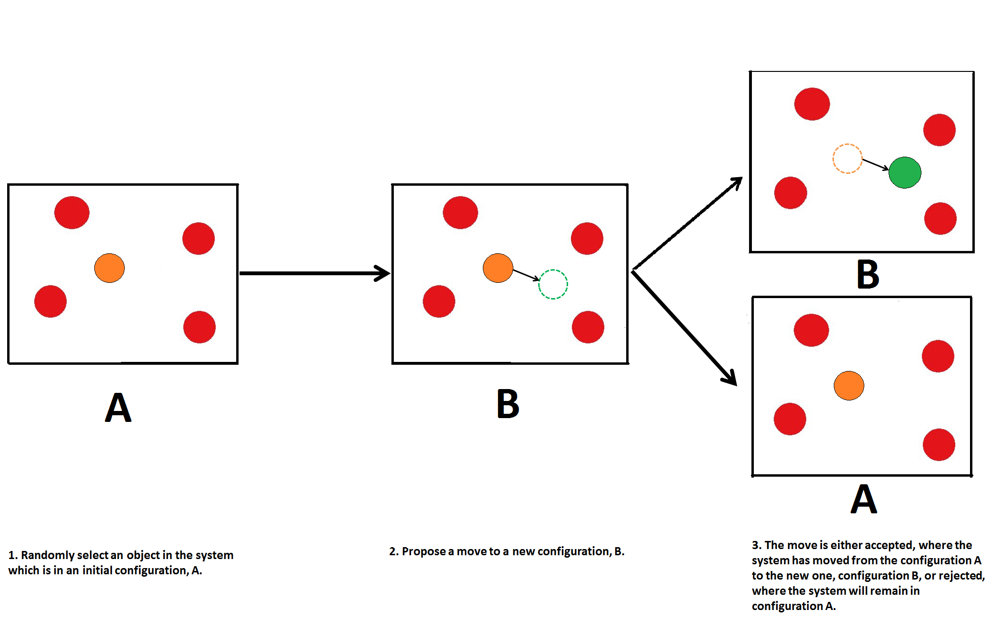

.. _tutorial_2:

---------------------------------------------
TUTORIAL 2: 2D Ising Model using Monte Carlo
---------------------------------------------

Authors: Chris King, James Grant - r.j.grant@bath.ac.uk

Introduction to Monte Carlo Methods
===================================

In the previous session, you were introduced to classical potential modelling simulation techniques, specifically Molecular Dynamics.  This provides useful background knowledge for the entirely different simulation technique that we will be discussing in this session: Monte Carlo. 

This course aims to familiarise undergraduates undertaking courses in the physical sciences with an alternative simulation technique to more common techniques like Molecular Dynamics and Molecular Mechanics: Monte Carlo.  In this course you will be using a general-purpose Monte Carlo program called 'DL_MONTE' to simulate different phenomena in simple systems.  By the end of this course, you should have a solid understanding of fundamental aspects of Monte Carlo theory and applications as well as how to set up and run Monte Carlo simulations using DL_MONTE.  

Monte Carlo (MC) is the name given to a set of numerical techniques that use random numbers to solve numerical problems.  The earliest known uses of this type of method was to estimate the value of :math:`\pi` (Buffon's Needle) and  Enrico Fermi used a similar method in the 1930s in his work studying neutron diffraction.  The MC technique used today was invented in the 1940s by scientists working on the Manhattan Project at the Los Alamos National Laboratory in the US.  Due to the sensitive nature of the work during World War 2, the technique was given the codename 'Monte Carlo' after the casino in Monaco where relatives of one of the scientists liked to frequent.

Every type of system has a number of possible states or configurations that it can be in, in thermodynamics, this range of states is described by the Boltzmann distribution.  This range of possible configurations define the 'configurational space' of a system.  The essence of MC methods is that you take a system in a given initial configuration and then use random numbers to randomly change the configuration of the system in some manner, whether it be displacing a particle by a small amount, changing the system volume or adding/removing particles from a system.  This general process is called 'proposing a move' in MC calculations.  The 'move' being changing the system from one configuration to another and so it essentially 'moves' the system to a different configuration in its configurational space.  However, whether or not we accept or reject the potential move depends on what type of sampling scheme is being used.  

The most commonly-used method of sampling configurational space is the Metropolis Algorithm.  Its function is as follows:

1. Randomly select a particle in the system and proposes a move to another configuration
2. Calculate the energy of both the old and new configurations
3. Apply the following condition:

.. math::

         P_{\mathrm{acc}}(\mathbf{r}_1 \rightarrow \mathbf{r}_2) = \min(1, \exp \ \Bigl(- \frac{E(\mathbf{r}_2) - E(\mathbf{r}_1)}{kT}\Bigr) \ )

where :math:`P_{\mathrm{acc}}(\mathbf{r}_1 \rightarrow \mathbf{r}_2)` is the probability of accepting the move from the initial configuration, :math:`\mathbf{r}_1`, with an energy, :math:`E(\mathbf{r}_1)`, to the new configuration, :math:`\mathbf{r}_2`, with an energy, :math:`E(\mathbf{r}_2)`.  The function min() means that the smallest value in the brackets is chosen.  If the energy of the new configuration is less than that of the original, *i.e.* :math:`E(\mathbf{r}_2) < E(\mathbf{r}_1)`, then :math:`E(\mathbf{r}_2)-E(\mathbf{r}_1) < 0` and so :math:`\exp \ \Bigl(- \frac{E(\mathbf{r}_2) - E(\mathbf{r}_1)}{kT}\Bigr) \  > 1` and so the move is accepted with :math:`P_{\mathrm{acc}}(\mathbf{r}_1 \rightarrow \mathbf{r}_2) = 1`.  If the new energy is greater than the energy of the original configuration, *i.e.* :math:`E(\mathbf{r}_2) > E(\mathbf{r}_1)`, then :math:`E(\mathbf{r}_2)-E(\mathbf{r}_1) > 0` and so :math:`\exp \ \Bigl(- \frac{E(\mathbf{r}_2) - E(\mathbf{r}_1)}{kT}\Bigr) \  > 1` and the move is accepted with probability :math:`P_{\mathrm{acc}}(\mathbf{r}_1 \rightarrow \mathbf{r}_2) = \exp \ \Bigl(- \frac{E(\mathbf{r}_2) - E(\mathbf{r}_1)}{kT}\Bigr) \ < 1`.the relative energies associated with the two configurations.  To determine whether the move is accepted or rejected, the difference in the energy associated with both the initial and final configurations is calculated and measured against some defined acceptance criterion.  If the criterion is met then the move is accepted and the system changes its configuration, before the next move is proposed, otherwise the move is rejected and the system configuration does not change. A schematic representation of the MC process is shown in Figure 1.

   **Figure 1**: Proposing a move in Monte Carlo.  This diagram shows a 'step' in Monte Carlo simulations.

|think| Even if the proposed move leads to a higher-energy configuration, there is still a non-zero probability of it being accepted! Why should this be the case?

.. |think| image:: images/General/think.png
   :height: 100 px
   :scale: 25 %

|think| What happens to the total number of accepted moves in a given simulation as we change the temperature?

MC is a stochastic method, which means that the final state of the system cannot be predicted precisely based on the initial state and parameters, but through statistical analysis, reliable results can be obtained.  This contrasts with other techniques like molecular dynamics, which are deterministic, where starting in a known initial state should lead to the same (or similar) outcomes.  This distinction allows MC to be used in a variety of applications across the scientific community where deterministic techniques are ineffective, such as phase co-existence and criticality, adsorption, and development of solid-state defects [#f1]_.  Likewise, there are other instances where MC is much more inefficient than deterministic methods.

The relability of MC results depends upon the method used to sample the configurational space of the system, if our sampling is not representative of all the possible states that the system can exist in, then any results will be flawed.  In other words, if our sampling method returns the probability distribution we expect, then we know that are sampling method is reliable.  In thermodynamic systems, the probability distribution of available states is given by the Boltzmann distribution:

.. math::

   W(\mathbf{r}) = \exp {\Bigl(\frac{E}{kT}\Bigr)} 

where :math:`W(\mathbf{r})` is the probability of being in a state of energy, also known as the statistical weight, *E*, at temperature, *T*, and *k* is the Boltzmann constant.  The ratio of Boltzmann distributions at two different energies, :math:`E_2` and :math:`E_1`, is known as the Boltzmann factor:

.. math::
  
   \frac{W(\mathbf{r}_1)}{W(\mathbf{r}_2)} = \exp {\Bigl(\frac{E_2 -E_1}{kT}\Bigr)}

So if our sampling method yields the Boltzmann distribution, we know that our simulation accurately reflects real systems.  There are many possible ways one can sample the configurational space of a simulated system, the intuitive case is simple random sampling in that we move randomly from one configuration to another.  However, this process is only reliable in systems with a constant probability distribution of states as it does not take into account the respective weighting of a given configuration.  For example, it can under-represent a small number of configurations who contribute significantly to the overall state of the system.  In order to return the Boltzmann distribution, MC simulations enforce a condition known as *detailed balance*, which is a sufficient, but not necessary condition (*i.e.* there are simpler conditions one could apply that could still get the same distribution).  We will discuss detailed balance in more detail in later sessions. 
 
Having discussed the concepts behind MC simulation methods, it is time to demonstrate how to apply them to a physical system.  This tutorial will be centred on a MC simulation of the magnetic properties of solid materials.

Ising Model of Magnetism
========================

An application where MC is more effective than deterministic methods is simulating the magnetic behaviour of solid state materials.  

Our simulation will be based on a 2D Ising model, which describes the macroscopic magnetic behaviour of a solid material as a result of the relative orientation of electron spins within the crystal lattice of a material.  As you may recall, each electron has an intrinsic 'spin'.  In simple terms, the spin of an electron can be thought of as a magnetic moment, with two possible orientations: 'up' and 'down'.  If an external magnetic field is applied to a material, then the spins of the electrons within the material can interact with this field and the material can give the material its own magnetic field based on how the electron spins are aligned relative to each other.  

This idea helps define several classes of magnetic behaviour: diamagnetism, paramagnetism, ferromagnetism and antiferromagnetism.  Diamagnetism occurs in materials whose electron spins preferentially anti-align with an external field, creating a magnetic field in the material that opposes and repels the external field.  Paramagnetism is where the spins preferentially align with an external field, generating a (weak) magnetic field in the material which supports the external field.  Ferromagnetism has some similarity to paramagnetism in that, under an external field, electron spins preferentially align with the external field, however, unlike paramagnetic materials, the material will continue to generate its own magnetic field even when the external field that initiated it is removed.  At *T* = 0 K, all spins will be aligned and remain unchanged, so the material will never lose its magnetic field.  However, in reality, the material will lose its magnetic field over time as every-so-often, a spin will flip due to the effect of finite temperature.  Ferromagnetism is the strongest type of observed magnetism and ferromagnetic materials form the common magnets used in day-to-day life.  Antiferromagnetism is similar to ferromagnetism in that an antiferromagnetic material will generate its own magnetic field without the presence of any external fields, however, the electron spins preferentially anti-align with each other, leading to a 'checkerboard' pattern shown in Figure 1b.  Figure 1 gives the ideal configurations for a ferromagnetic and antiferromagnetic material under an external field as a 2D lattice of colour-coded spins.

.. figure:: images/Tut_2_images/ferro_antiferro.png
   :align: center

   **Figure 2:** (a) A 2D schematic of (a) a ferromagnetic material and (b) an antiferromagnetic material under an external magnetic field.  Yellow indicates the spins that are aligned with the field and purple are spins that are anti-aligned.

In the 2D Ising model, our material is represented by a 2D square grid of lattice sites, where each site represents an electron spin in the solid structure.  The main factor influencing whether a given site's spin is aligned with its neighbours in a crystal, and hence what type of magnetism the material displays, is its exchange energy, *E*, which in the Ising model is given by:

.. math::

	E = -J \sum_{<i,j>} s_{i}s_{j}

where *J* is the coupling constant between adjacent sites in a given material and :math:`s_{i/j}` is the spin of the at site i/j in the lattice, respectively.  The <...> here mean the sum goes over the nearest neighbours of the atom in position (i,j), *i.e.* over the sites at positions  (i-1, j), (i+1, j), (i, j-1) and (i, j+1) only.  All physical systems will try to minimise their energy, and so the sign of *J* determines whether spin alignment (ferromagnetism) or anti-alignment (antiferromagnetism) is favourable.  If :math:`J > 0`, then if :math:`\sum_{<i,j>} s_{i}s_{j} > 0`, *i.e.* the spin of the i\ :sup:`th` \ site is aligned with the majority of its neighbours, :math:`E < 0` and so the alignment of spins is energetically favourable and will be the preferred state of the system.  If :math:`J < 0`, then the anti-alignment of the i\ :sup:`th` \ site is energetically favourable.

The exchange energy can be thought of as an activation barrier for an atom to change its spin depending on the spins of its neighbours.  This means that, like with any physical system with an energy barrier, spontaneous thermal fluctuations can overcome the barrier and cause some sites to flip their spin, with the likelihood of flipping a spin increasing as temperature increases.  Therefore, ferromagnetic materials only show domains at temperatures under a specific critical, or Curie, temperature, :math:`T_{c}`.  Above this point, ferromagnetic materials lose their ability to retain magnetisation without requiring an external magnetic field.

For more information on the Ising model, consult either [#f2]_ or [#f3]_.

|think| Write an expression for the energy difference between the initial and final configurations, :math:`E(\mathbf{r}_2) - E(\mathbf{r}_1)`, for the 2D Ising model.

Exercise 1)
-----------

The aim of this exercise is to familiarise yourself with running MC calculations on a simple 2D Ising model of a ferromagnetic material. The material is represented by a 64x64 2D lattice of sites, each representing a spin in the solid structure.  Initially, all sites in the grid are aligned.  We will be running a MC simulation to look at how the overall spin alignment (magnetisation) and energy of the system evolves with both time and temperature.  The MC process for the 2D Ising model is outlined below:

1. Select a site on the lattice and propose a 'move' by inverting its spin.
2. Calculate the energy before, :math:`E_1`, and after the proposed move, :math:`E_2`, using equation x.
3. Accept the move using the Metropolis condition:

.. math::

         P_{\mathrm{acc}}(\mathbf{r}_1 \rightarrow \mathbf{r}_2) = \min(1, \exp \ \Bigl(- \frac{E_2 - E_1}{kT}\Bigr) \ )

4. Move to the next site and repeat.

Actions 1-3 define a MC 'step', which are used to define how long a calculation will run.  *N.B.* a step is counted regardless of whether the propsed move was accepted or rejected.  The program selects sites systematically in the lattice, starting in one corner and going row-by-row until the end of the lattice is reached, so (on average) each site will have had one proposed move.  This defines a MC 'sweep' of the system.  Once one sweep is complete, the program will begin a new sweep and stop when it has completed a set number of MC steps.  

|action| Go to 'inputs' :math:`\rightarrow` 'Tut_2' :math:`\rightarrow` 'main' :math:`\rightarrow` 'Init' and copy the contents into a new directory in your domain.  The CONFIG file displays the initial configuration of your system, the CONTROL file allows you to set the parameters and constraints for your simulation, and the FIELD file describes all interactions in the system (although they may look slightly different to the ones presented in the last session, they perform the same roles).  Though we will be going through the function of these in detail in the next session, it may be helpful to have a look and familiarise yourself with their contents.  

.. |action| image:: images/General/action.png
   :scale: 5 %

**instructions for running a simulation**

As the calculation runs and completes, you will notice several new files appear in your directory.  These have similar roles to their counterparts from the previous session and will be explained in detail in the next tutorial.  The files you will be using throughout this tutorial will be the OUTPUT.000 and the PTFILE.000.  

Now that you have all the output data you could possibly need from this calculation, we shall proceed with extracting the following data from the OUTPUT.000 and PTFILE.000: the time evolution of magnetisation and the distribution of the magnetisations over the course of the simulation.  

|action| You will need to employ the 'analysis.sh' script by running the following command in the directory containing your output files::

	analysis.sh
	
The command should complete almost instantly and you should see several new files: M_seq.dat, M_hist.dat, M_hist.png, and M.dat.  These files contain: time-evolution of magnetisation, a normalised magnetisation frequency distribution (in both data and plotted forms), and the average magnetisation at the temperature of the simulation, respectively.

We shall now proceed to run the calculation at higher temperatures to obtain the temperature-dependence of the magnetisation.  

|action| Create a new directory for each temperature and copy the CONFIG, CONTROL and FIELD files from your first calculation to them.
  
|action| Open the CONTROL file in each and increase the temperature to a value of your choosing (HINT: you will not need to go above 5.0 K!) and run the calculations.    

|action| Once each calculation is complete, run the analysis script in the same manner as above to obtain the relevant data.

|action| From your calculations, plot magnetisation vs temperature for the system.  |think| Comment on the shape of your graph and estimate the critical temperature, :math:`T_{c}`, from it. *N.B.* it may be wise to run calculations at several temperatures around the perceived critical point.  

For any general 2D lattice where coupling along rows and along columns are equal, :math:`T_{c}` is given by:

.. math::

	T_{c} = \frac{2}{\ln(1+\sqrt{2})} \approx 2.269

|think| Does your estimation of :math:`T_{c}` agree with that predicted by the above equation? Account for any observed discrepancies.

|action| Plot the time-evolution of magnetisation (on the same graph) for:

	a) :math:`T < T_{c}`
	b) :math:`T \approx T_c`
	c) :math:`T > T_{c}`

|think| Comment on any differences between in these plots and rationalise them using your knowledge of ferromagnetism.  Do the results correspond to the predictions of the Ising model?

|action| Also, have a look at the magnetisation histogram for some of your temperatures and describe how the distribution of magnetisations appears to change with temperature.  |think| Does this behaviour support the rest of your output data?

Extension:
----------

You have seen what happens as the system is heated, but you can also look at the magnetisation upon cooling the system from a state above the critical temperature to a state below the critical temperature. 

|action| Take the REVCON from one of your simulations where :math:`T>T_{c}`, copy it into a new directory and rename it 'CONFIG'.  Also copy the CONTROL and FIELD files into this directory and change the temperature to :math:`\sim 10^{-3} K`.  Then run the simulation.  

|action| Once the simulation is complete, use the analysis.sh script to extract the output data and plot the time evolution of magnetisation.  Record your observations.  
|think| Does this agree with magnetic behaviour predicted by the Ising model? 

|think| How does this compare with the time evolution at :math:`T > T_{c}`?

Exercise 2)
-----------

This exercise will demonstrate the stochastic nature of MC simulations as well as how the Metropolis algorithm produces reliable and accurate results for this simple 2D Ising model.

We have seen what happens when we start the simulations from a fixed starting configuration (all spins aligned), but what will happen when we start from a random configuration? 

|action| Create a new directory and copy the CONFIG, CONTROL and FIELD files from one of your previous calculations into it. 

|action| Replace the line starting with 'seeds' to just 'ranseed'.  

|action| Make a note of the temperature and run the calculation and use analysis.sh on the output data as you have done in the previous exercise. 

|action| Run this calculation on these input files several times (WARNING: remember to copy the output files into separate directories each time before running the calculation again!) and plot the time-evolution of the magnetisation for each calculation.  Each of these calculations represent running the simulation on a different, randomly-generated initial configuration at the same temperature.  

|think| How does the final magnetisation of each random initial configuration compare with each other, *i.e.* does the initial configuration have an effect on the outcome of the simulation? 

Extension:
----------

|action| For one of your calculations, find out the initial configuration by typing the following into the command line::

	grep seeds OUTPUT.000

Running this command should return a line containing four integer numbers.  

|action| Create a new directory and copy the CONFIG, CONTROL and FIELD files into it.  

|action| Go to your CONTROL file and replace 'ranseed' with 'seeds int1 int2 int3 int4' where 'int' are the numbers from the command line.

|action| Re-run the calculation with this CONTROL file and plot the magnetisation vs time.  |think| Compare this with the equivalent \'ranseed\' calculation data.  

|think| What do you notice about the magnetisation evolution in the two calculations? Does this confirm that the stochastic nature of Monte Carlo methods can produce reliable results?

Conclusions:
============

Now that you have reached the end of this tutorial, you will hopefully have a better understanding of the Monte Carlo method and the motivation for its use. You have simulated the magnetic properties of a 2D material based on the Ising model and obtained:

- the temperature-dependence of magnetisation
- the evolution of magnetisation with time
- validation of the stochastic nature of Monte Carlo methods

In the next tutorial, you will be introduced to a general Monte Carlo program called DL_MONTE and use it to model the thermal properties of a Lennard-Jones material.

Extensions (optional):
======================

1. Antiferromagnetism:
----------------------

So far, you have looked at how the magnetic behaviour of a ferromagnetic system changes over time and temperature, but there is another possible type of magnetism called antiferromagnetism, where the sign of the coupling constant, *J*, changes sign.  This means that it is now favourable for the spin of one site to be opposed to the spin of its neighbours, resulting in a preferred 'checkerboard' pattern of magnetisation on the 2D lattice.  You can investigate the magnetic behaviour in this case using the 2D Ising model.

**script for changing the signs of the coupling constants in the FIELD file and create a new directory for the initial calculation**

|action| Now investigate the magnetic properties of this material in a manner similar to what you have done in this tutorial.

|think| Compare your results of the antiferromagnet with the ferromagnet.  Rationalise any observed differences in terms of exchange energy and alignment of spins.

.. Link to next tutorial

.. rubric:: Footnotes

.. [#f1] S. Mordechai (Editor), *Applications of Monte Carlo Method in Science and Engineering* [Online]. Available: https://www.intechopen.com/books/applications-of-monte-carlo-method-in-science-and-engineering 
.. [#f2] J. V. Selinger, "Ising Model for Ferromagnetism" in *Introduction to the Theory of Soft Matter: From Ideal Gases to Liquid Crystals*.  Cham: Springer International Publishing, 2016, pp. 7-24.
.. [#f3] N. J. Giordano, *Computational Physics*.  Upper Saddle River, N.J.: Prentice Hall, 1997. 